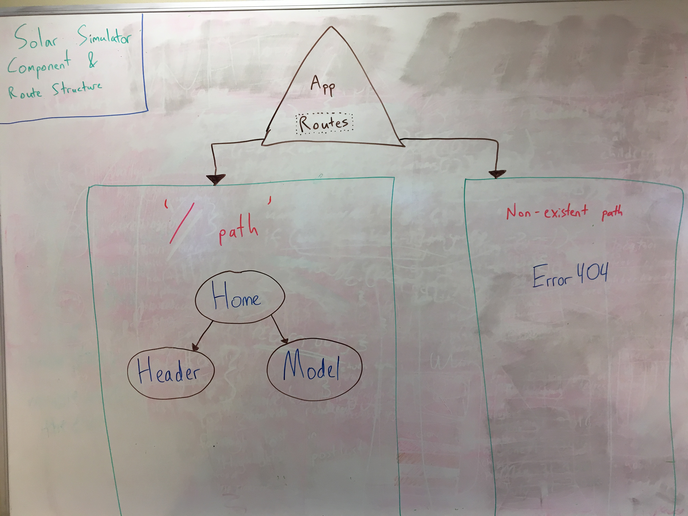

# Solar Simulator
##### Solar system 3D model built with three.js and React, Epicodus team-week project, 5/15/19

By Ian Cook Westgate Robbie Kruszynski, Ryan McLean, Slater Smith, and Travis Toal

## Description

The Solar Simulator is designed with two goals in mind. First, use the three.js Javascript 3D library to depict a visually stunning and responsive reproduction of the solar system. Second, utilize the International Space Station's (ISS) API to give an approximate portrayal of its current location in orbit around Earth.

## User Stories

These fictional user stories were built to provide behavior-driven guidelines for effectively developing our application. They also serve to further articulate the application's purpose. Key user stories are as follows:

* As a science teacher, I would love a spectacular and dynamic website that my students can use to learn more about the planets of the solar system.
* As a programmer looking for new tech to use and learn from, I want the website to show the power of three.js across more than one object.
* As a potential investor, I am looking for a website that can harness both visual excitement in the user as well as provide a learning experience.

## Setup

* In your terminal, if you intend to view the code and want to make the React pages more legible, enter `apm install react`.
* Using your terminal, clone this repo by inputting `git clone https://github.com/travisty12/solar-simulator.git`.
* Navigate to the folder in the terminal by typing in: `cd solar-simulator`.
* In your terminal, enter `npm install` to install necessary dependencies.
* Then enter `npm run start` to view the project, which will be opened in a new browser tab.

## Site Features

* The solar system (not to scale) is visually depicted on the screen. This includes all planets, the sun, and Earth's moon.
* The user can use their mousewheel along with click and drag on the screen in order to change the visual direction. This is currently locked to Earth's position.
* The user can view the ISS's approximate position in orbit around Earth, updated every 5 seconds from NASA's API.
* The user can select the different planets in the upper-left header menu to navigate to any planet or the sun.
* The user can view educational content about any selected planet or the sun by clicking the top-right menu icon.
* The user can see the location of the International Space Station in relation to the earth, appearing as a red orb.

## Future Features

* Zooming into the ISS's position should let the user view a picture of what the interior of the ISS looks like to the astronauts who use it.

## Technologies Used

* JavaScript
  * three.js
  * React
* Node Packet Manager (NPM)
* Babel
* Webpack
* ESLint

## Component Structure    

## Known Bugs

* Load times can be laggy, affecting animations at times.

## Support and contact details

_Email iancookwestgate@gmail.com with any questions._

## License

This software is licensed under the MIT license.

Copyright (c) 2019 **Robbie Kruszynski**, **Ryan McLean**, **Travis Toal**,**Slater Smith**, **Ian Cook Westgate**, and **Ian Cook Westgate**

