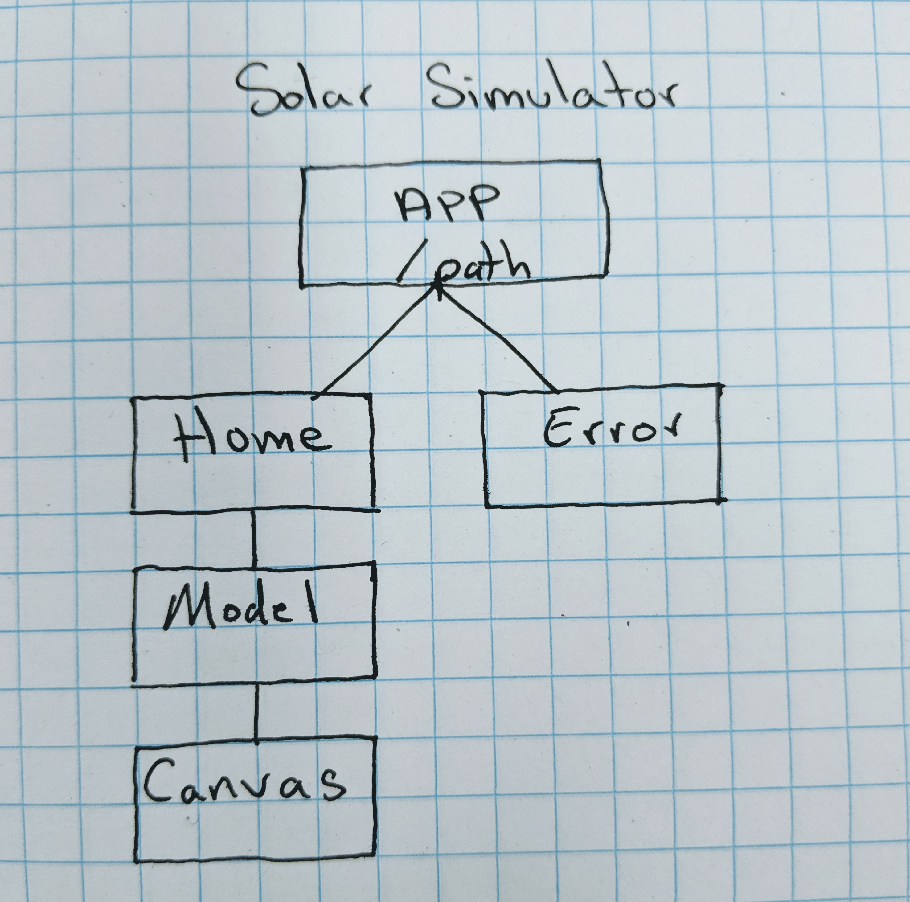

# Solar Simulator
##### Solar system 3D model built in React utilizing threeJS

By: Travis Scott, Robbie Kruszynski, Ryan McLean, Slater Smith, and Ian Cook Westgate

View the site live at [Icarus Lives](https://www.icarus-lives.com/#/)

## Description

The Solar System Simulator was designed with two goals in mind.
* First, use the three.js Javascript 3D library to depict a visually stunning and responsive reproduction of the solar system.
* Second, utilize the International Space Station's (ISS) API to showcase its current location in orbit around Earth.

## Setup

* Using your terminal, clone this repo by inputting `git clone https://github.com/travisty12/solar-simulator.git`.
* Navigate to the folder in the terminal by typing in: `cd solar-simulator`.
* In your terminal, if you intend to view the code and want to make the React pages more legible, enter `apm install react`, and open the file with `atom .`.
* In your terminal, enter `npm install` to install necessary dependencies.
* Then enter `npm run start` to view the project, which will be opened in a new browser tab.

## Site Features

* The solar system is visually depicted on the screen. This includes all planets, the sun, Earth's moon, Europa, and the ISS
* The user can use their mousewheel along with clicking and dragging on the screen in order to change the camera distance and orientation.
* The user on mobile can touch / pinch / drag on the screen in order to change the camera distance and orientation.
* There are visual rings to demonstrate the planets' orbits and to help guide the eye to locate the planets when zoomed out.
* The user can view the ISS's position in orbit around Earth, updated every 5 seconds from wheretheissat API.
* The user can select the different planets in the upper-left header menu to navigate to any planet or the sun.
* The user can view educational content about any selected planet or the sun by clicking the top-right menu (i) icon.
* Accurate rotational speed for the earth (24h) and moon ( 28 days around the earth ), and accurate orbital speeds for all of the planets.
* Use Redux to update the information that is displayed depending on the planet your on.

## Technologies Used

* JavaScript
  * three.js
  * React
* (npx create-react-app)
* Babel
* Redux
* Webpack
* ESLint

## Component Structure    

## Known Bugs

* None as of 05/16/2019

## Support and contact details

_Email travisty12@gmail.com, rmcleandev@gmail.com, robbiekruszynski@gmail.com or with any questions._

## License

This software is licensed under the MIT license.

Copyright (c) 2019 **Robbie Kruszynski**, **Ryan McLean**, **Travis Scott**
